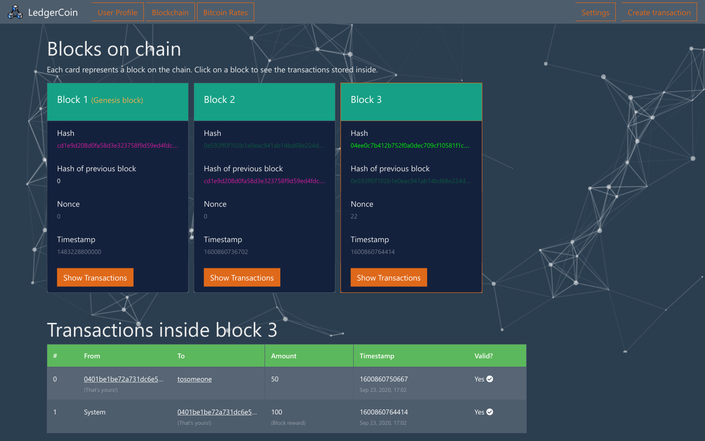

[]()
[](https://github.com/vijethph/LedgerCoin/issues)
[](https://github.com/vijethph/LedgerCoin/graphs/contributors)
[](https://github.com/vijethph/LedgerCoin/network)
[](https://github.com/vijethph/LedgerCoin/stargazers)
[](https://github.com/vijethph/LedgerCoin/blob/master/LICENSE)
[](https://www.typescriptlang.org/)
[](https://angular.io/)
[](https://forthebadge.com)
[](https://render.com/deploy?repo=https://github.com/vijethph/LedgerCoin)


<br />
<p align="center">
  <a href="https://github.com/vijethph/LedgerCoin">
    
  </a>

  <h2 align="center">LedgerCoin</h2>

  <p align="center">
    An Angular App that visualizes the working of blockchain.
    <br />
    <br />
    <a href="https://github.com/vijethph/LedgerCoin/issues">Report Bug</a>
    ·
    <a href="https://github.com/vijethph/LedgerCoin/issues">Request Feature</a>
  </p>
</p>

<!-- TABLE OF CONTENTS -->

## Table of Contents

- [About the Project](#about-the-project)
  - [Built With](#built-with)
- [Getting Started](#getting-started)
  - [Prerequisites](#prerequisites)
  - [Installation](#installation)
- [Usage](#usage)
- [Contributing](#contributing)
- [License](#license)
- [Contact](#contact)
- [Acknowledgements](#acknowledgements)

<!-- ABOUT THE PROJECT -->

## About The Project

 

This is a Angular app that uses [MongoDB](https://www.mongodb.com), [Express Framework](https://expressjs.com), [Node.js](https://nodejs.org/en) and [Angular Framework](https://angular.io) to visualize the working of Blockchain, with user authentication. It uses a simple implementation of Blockchain with Proof-of-Work algorithm, verification, wallet generation and transaction signing features. It also makes use of [CoinGecko API](https://www.coingecko.com/en/api) to display the latest currency exchange rates with respect to BitCoin.

### Built With

This project is entirely built with the following components and languages:

- [MongoDB](https://www.mongodb.com) - NoSQL Database
- [Express](https://expressjs.com/) - Server Framework
- [Angular Framework](https://angular.io) - Frontend Component-based Framework
- [Node.js Runtime](https://nodejs.org/en) - Server Environment
- [TypeScript](https://www.typescriptlang.org/) - Programming Language
- [CoinGecko API](https://www.coingecko.com/en/api) - Currency Exchange Rate API

<!-- GETTING STARTED -->

## Getting Started

Follow these instructions in order to get a copy of the project up and running on your local machine for development and testing purposes.

### Prerequisites

Node.js>=16 and MongoDB>=4.2 should be present. After installation, check Node.js version, and MongoDB daemon status using

```sh
node --version
service mongod status
```

### Installation

1. Clone the repo

```git
git clone https://github.com/vijethph/LedgerCoin.git
```

2. Open the downloaded folder

```sh
cd LedgerCoin
```

3. Modify the MongoDB URI in `server.ts` file inside `src` folder as per your DB configuration. Then import the required dependencies in both of these folders: `src` and `client`, using

```sh
npm install
```

4. Run the program using

```sh
npm run dev
```

The app should be running in `http://localhost:3000` in your browser.   

Another way to install this app is to use Docker Compose. Run this command to start the app:
```
docker-compose up
```
This will run the app at http://localhost:3000, which can be seen in your browser.

<!-- USAGE EXAMPLES -->

## Usage

Once the app starts, you can create an account in `Register` page, and then login to find the visualization of blockchain. Some transactions are already made by the system for you to get a basic idea of how the blockchain works. You can click on each block, and find the corresponding transactions made under each block.

You can also create transactions by giving money (not real, of course) to any person, and sign the pending transactions. You can also change the difficulty of mining, and view the wallet amounts of parties involved.

<!-- CONTRIBUTING -->

## Contributing [](https://github.com/vijethph/LedgerCoin/pulls)

Contributions are what make the open source community such an amazing place to be learn, inspire, and create. Any contributions you make are **greatly appreciated**.

1. Fork the Project
2. Create your Feature Branch (`git checkout -b feature/AmazingFeature`)
3. Commit your Changes (`git commit -m 'Add some AmazingFeature'`)
4. Push to the Branch (`git push origin feature/AmazingFeature`)
5. Open a Pull Request

<!-- LICENSE -->

## License

Distributed under the MIT License.

<!-- CONTACT -->

## Contact

Vijeth P H - [@vijethph](https://github.com/vijethph)

Project Link: [https://github.com/vijethph/LedgerCoin](https://github.com/vijethph/LedgerCoin)

## Thank You!

[](https://forthebadge.com)

If you like this project, please ⭐ this repo and share it with others 👍

<!-- ACKNOWLEDGEMENTS -->

## Acknowledgements

- [MongoDB Docs](https://docs.mongodb.com/)
- [Angular Framework Docs](https://angular.io/docs)
- [CoinGecko API Docs](https://www.coingecko.com/api/documentations/v3)
- [SavjeeCoin](https://github.com/Savjee/SavjeeCoin)
